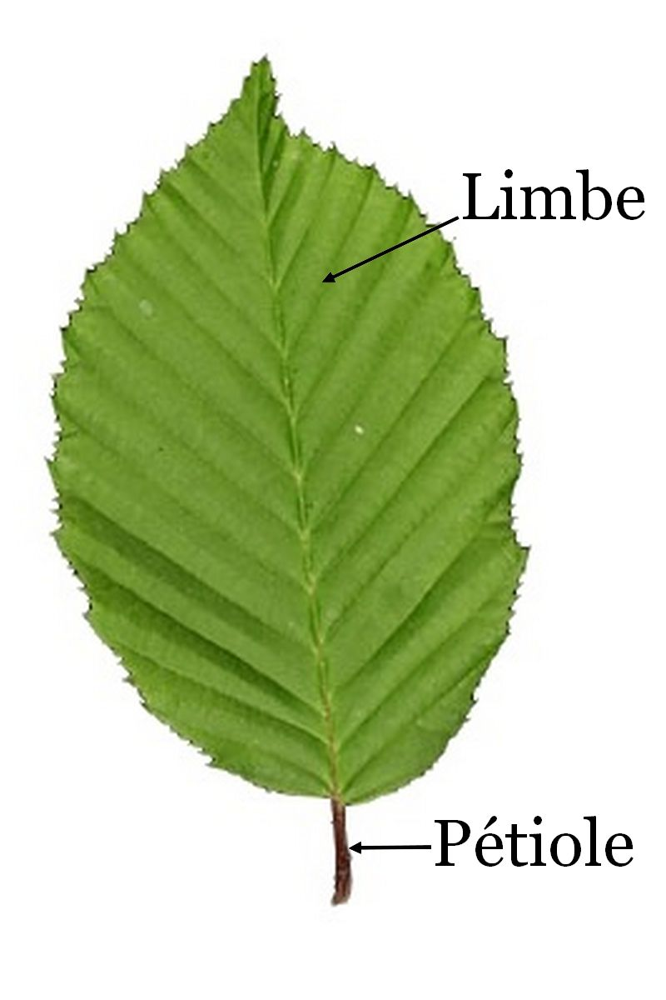
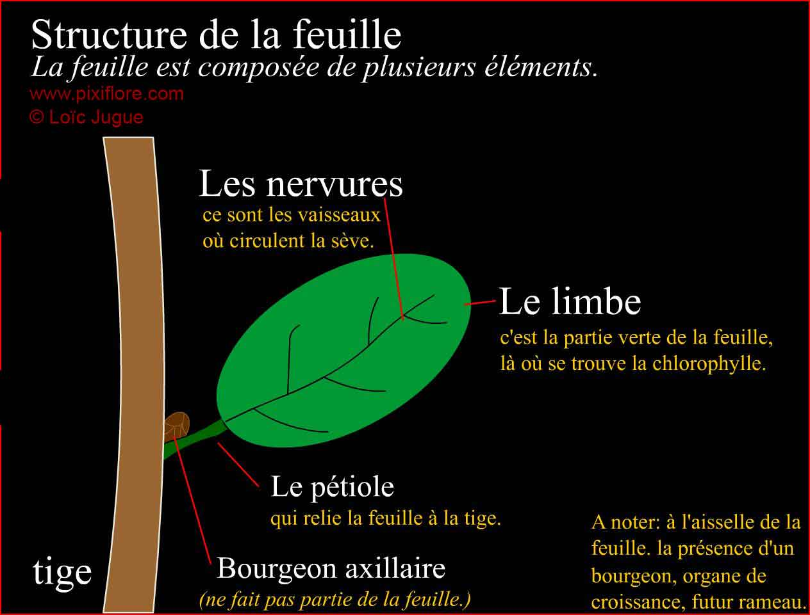
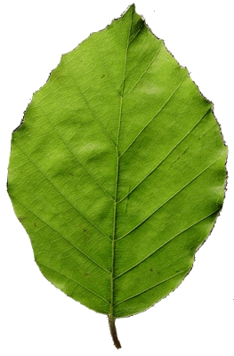
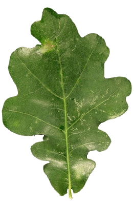
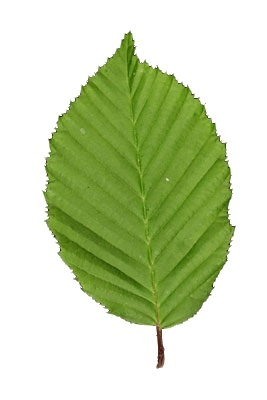
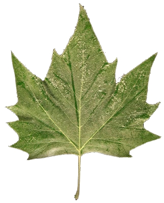
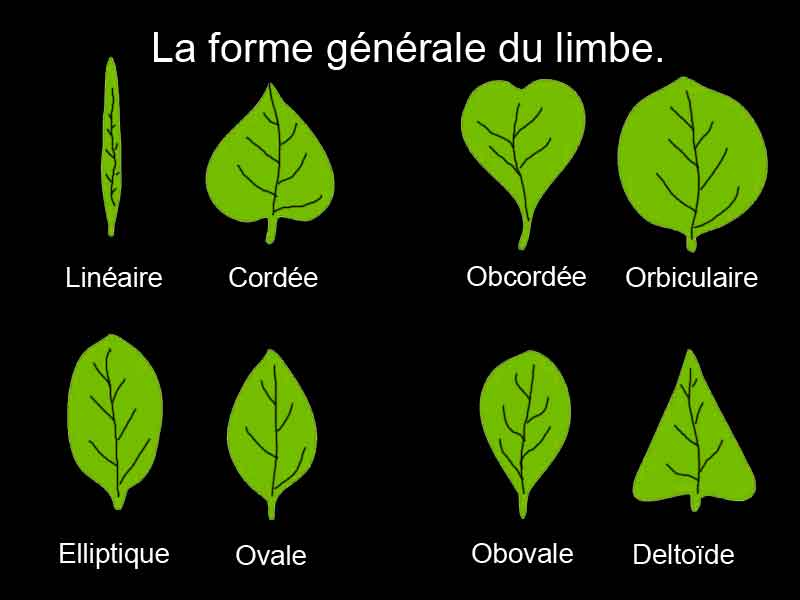
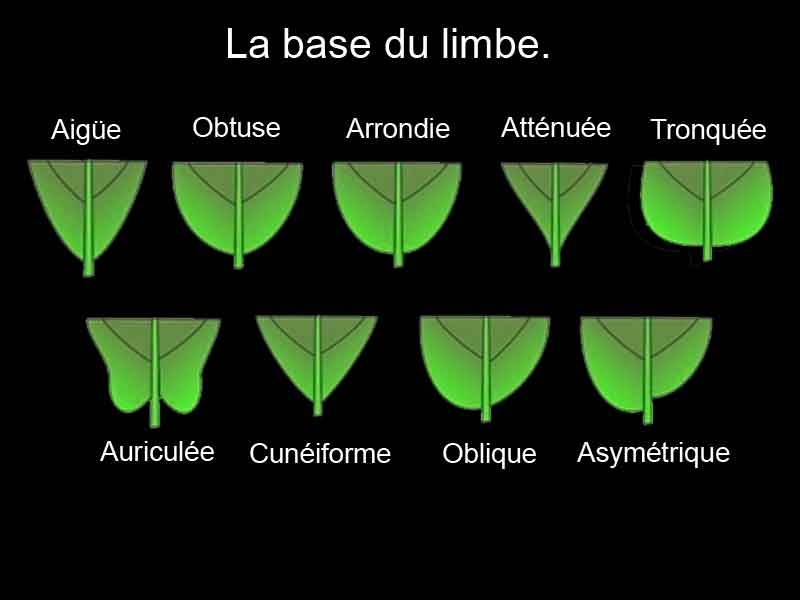
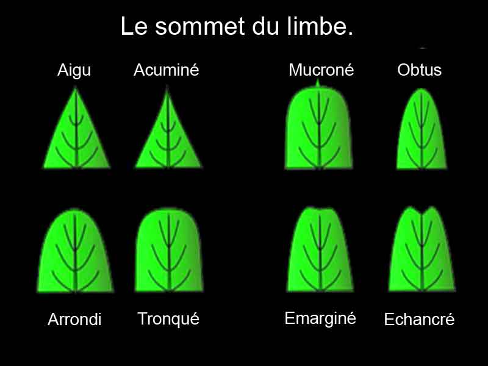
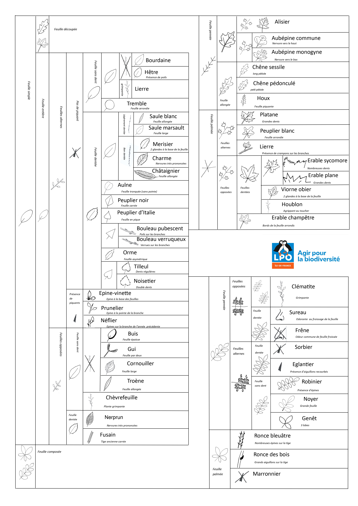

# Reconnaissance des arbres

Source : 
- https://www.reconnaitre-les-arbres.fr/initiation/reconnaitre_les_arbres_initiation_accueil.html
- https://www.lpo.fr/lpo-locales/lpo-ile-de-france/education-a-la-nature/outils-pedagogiques-lpo-idf2/identification-des-arbres-et-arbustes

## Feuilles et aiguilles

La première chose à connaître est de faire la différence entre les arbres qui ont des feuilles, les feuillus et ceux qui ont des aiguilles ou parfois des écailles: les conifères.

Les aiguilles sont de minuscules feuilles qui font la photosynthèse. Elles sont généralement persistantes c'est-à-dire qu'elles restent plusieurs années sur l'arbre sans tomber.

La plupart des feuillus ont des feuilles caduques, c'est-à-dire qu'elles tombent à l'automne. Autre caractéristique des feuillus, ils ont des fleurs bien visibles et font des fruits. Les conifères eux ont des fleurs réduites

## Qu'est-ce qu'une feuille ?

Pour un botaniste, une feuille est constituée d'un limbe et d'un pétiole.

La pétiole est la partie ligneuse qui relie le limbe à la tige et où passent les vaisseaux conducteurs de sève.  
Le limbe est la partie verte et large de la feuille qui fait la photosynthèse.

À l'aisselle des feuilles, on retrouve des bourgeons qui seront le point de départ d'un futur rameau.

La feuille est un organe très important pour les arbres. C'est une véritable usine chimique qui va permettre la transformation de certains éléments chimiques en sucre grâce à l'énergie solaire. C'est ce qu'on appelle la photosynthèse.

## Feuille simple et feuille composée

Une feuille est dite simple quand elle est juste constituée d'un limbe et d'un pétiole. À la jonction du pétiole et de la tige, on trouve un bourgeon. 

Une feuille composée est une feuille généralement grande et composée de plusieurs petites feuilles appelées folioles. À la base de la feuille composée on trouve un bourgeon (ce qui n'est pas le cas pour les folioles et ce qui fait la différence avec une vraie feuille qui a toujours un bourgeon à sa base). La partie centrale qui relie les folioles est appelée rachis et ce qui relie la foliole au rachis pétiolule.

## Disposition des feuilles sur la tige

Une autre importante à observer est la disposition des feuilles le long de la tige. Les feuilles sont soit solitaires, soit opposées par deux, soit par trois ou plus (on parle alors de feuilles verticillées).

## La marge et la forme du limbe

La marge du limbe est différente en fonction des espèces d'arbres. La marge peut être entière (hêtre), ondulée (chêne), dentée (charme, chataîgnier, etc.) ou très découpée (le platane ou l'érable).

| Entière (hêtre) | Ondulée(chêne) | Dentée (charme, châtaignier, orme) | Très découpée (platane, érable) |
|---------------|--------------|-------------|----------------|
|   |    |   |  |

La forme du limbe est très importante, on y distingue : sa forme générale, sa base, son sommet et enfin sa marge.

        
 
    
 

## Sur le terrain

- Feuillu ou conifère ?
- Feuilles simples ou composées ?
- Comment sont disposées les feuilles sur le rameau ? (par un, deux, trois ?)
- Si la feuille est simple, comment est sa feuille ? Est-elle entière, dentée, lobée, très découpée ? Est-elle symmétrique ou dissymétrique ? Comment est sa forme générale ? Ovale, cordée, arrondie, lancéolée, autre ?

